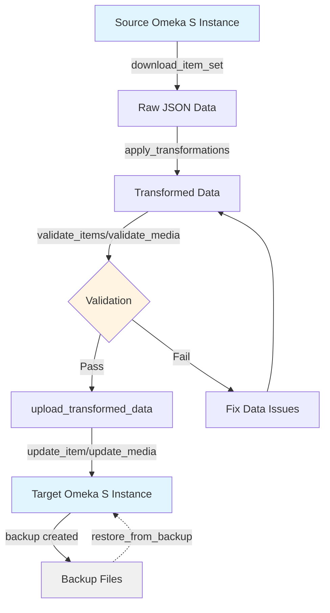
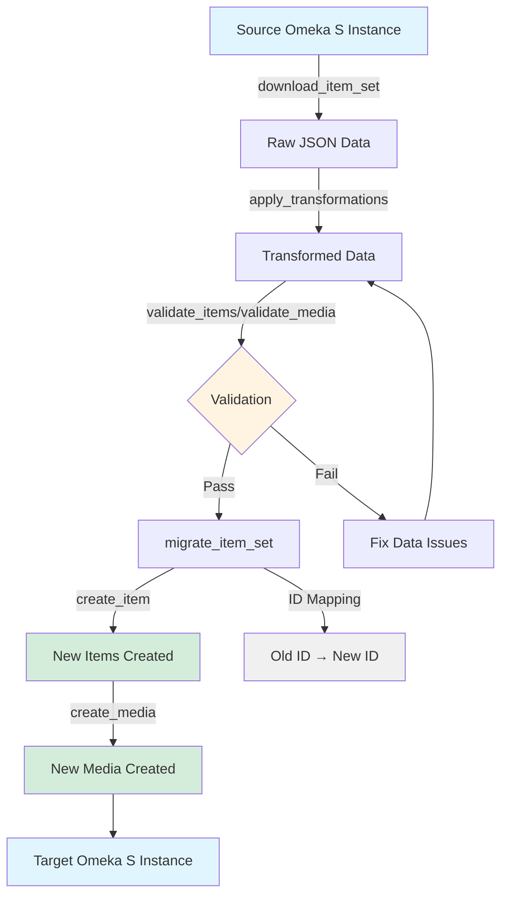
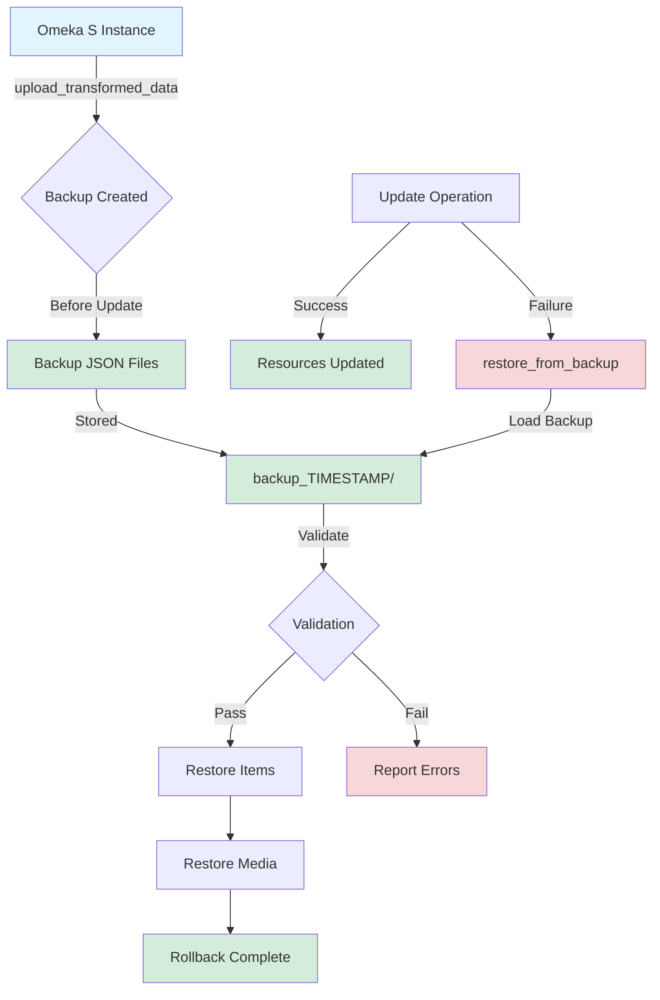

# OmekaAPI Documentation

## Overview

The `OmekaAPI` class provides a high-level Python interface for interacting with Omeka S instances. It supports reading, validating, transforming, creating, and updating cultural heritage metadata while ensuring data quality through comprehensive validation.

**Quick Start:** For most use cases, use the simplified CLI workflow:
- `workflow.py` - Simple command-line interface for download, transform, validate, upload
- Configuration via `.env` file for credentials
- All transformations enabled by default

## Workflows

### Update Workflow (Existing Data)

This workflow updates existing resources in an Omeka S instance:



### Migration Workflow (New Data)

This workflow creates new resources in a target instance:



### Backup & Restore Workflow

This workflow provides safety mechanisms for destructive operations:



## Initialization

```python
from src.api import OmekaAPI

# Basic usage (read-only)
with OmekaAPI("https://omeka.unibe.ch") as api:
    items = api.get_items_from_set(10780)

# With authentication (required for updates)
with OmekaAPI(
    "https://omeka.unibe.ch",
    key_identity="your_key",
    key_credential="your_secret",
    timeout=30.0
) as api:
    result = api.upload_transformed_data("data/transformed/", dry_run=False)
```

**Parameters:**

- `base_url` (str): Base URL of the Omeka S instance
- `key_identity` (str | None): Optional API key identity for authentication
- `key_credential` (str | None): Optional API key credential for authentication
- `timeout` (float): Request timeout in seconds (default: 30.0)

## Core Operations

### 1. Read Operations

#### `get_item_set(item_set_id: int) -> dict[str, Any]`

Fetch a single item set by ID.

```python
item_set = api.get_item_set(10780)
print(item_set["o:title"])
```

#### `get_items_from_set(item_set_id: int, page: int | None = None, per_page: int = 50) -> list[dict[str, Any]]`

Fetch all items from an item set. If `page` is None, fetches all pages automatically.

```python
# Get all items
items = api.get_items_from_set(10780)

# Get single page
items_page = api.get_items_from_set(10780, page=1, per_page=100)
```

#### `get_item(item_id: int) -> dict[str, Any]`

Fetch a single item by ID.

```python
item = api.get_item(121200)
```

#### `get_media_from_item(item_id: int) -> list[dict[str, Any]]`

Fetch all media resources associated with an item.

```python
media_list = api.get_media_from_item(121200)
```

---

### 2. File Operations

#### `save_to_file(data: dict | list[dict], filepath: Path | str) -> None`

Save data to a JSON file with automatic directory creation.

```python
api.save_to_file(items, "backup/items.json")
```

#### `load_from_file(filepath: Path | str) -> dict | list[dict]`

Load data from a JSON file.

```python
items = api.load_from_file("backup/items.json")
```

---

### 3. Validation Operations

#### `validate_item(item_data: dict[str, Any]) -> tuple[bool, list[str]]`

Validate an item against the Pydantic data model.

```python
is_valid, errors = api.validate_item(item_data)
if not is_valid:
    for error in errors:
        print(f"Error: {error}")
```

#### `validate_media(media_data: dict[str, Any]) -> tuple[bool, list[str]]`

Validate a media resource against the Pydantic data model.

```python
is_valid, errors = api.validate_media(media_data)
```

#### `validate_item_set(item_set_id: int) -> dict[str, Any]`

Validate all items and media in an item set. Returns comprehensive validation report.

```python
report = api.validate_item_set(10780)
print(f"Items validated: {report['items_validated']}")
print(f"Items valid: {report['items_valid']}")
print(f"Errors: {len(report['errors'])}")
```

**Returns:**

```python
{
    "item_set_id": 10780,
    "timestamp": "2025-11-12T10:30:00",
    "items_validated": 100,
    "items_valid": 95,
    "items_invalid": 5,
    "media_validated": 200,
    "media_valid": 198,
    "media_invalid": 2,
    "errors": [
        {"type": "item", "id": 121200, "error": "o:title: Field is required"},
        ...
    ]
}
```

#### `validate_offline_files(directory: Path | str) -> dict[str, Any]`

Validate JSON files in a directory without connecting to Omeka S.

```python
result = api.validate_offline_files("data/transformed_itemset_10780_20251112/")
if result["overall_valid"]:
    print("✓ All files valid")
else:
    print(f"✗ Found {len(result['items_errors'])} item errors")
    print(f"✗ Found {len(result['media_errors'])} media errors")
```

---

### 4. Backup Operations

#### `backup_item_set(item_set_id: int, backup_dir: Path | str) -> dict[str, Path]`

Create a complete backup of an item set including items, media, and metadata.

```python
backup_paths = api.backup_item_set(10780, "backups/")
print(f"Backed up to: {backup_paths['manifest']}")
```

**Creates:**

```
backups/itemset_10780_20251112_103000/
├── item_set.json
├── items.json
├── media.json
└── manifest.json
```

#### `restore_from_backup(backup_dir: Path | str, dry_run: bool = True) -> dict[str, Any]`

Restore items and media from a backup by updating existing resources in Omeka S. **Requires authentication.**

⚠️ **Important:** This method UPDATES existing resources by ID. Resources must already exist in the target instance.

```python
# Dry run first (validate backup and preview)
status = api.restore_from_backup("backups/itemset_10780_20251112_103000/")
print(status["message"])
# "Dry run - backup validated successfully. Would restore 100 items and 200 media."

# Actual restore (requires auth)
with OmekaAPI(
    "https://omeka.unibe.ch",
    key_identity="your_key",
    key_credential="your_secret"
) as api:
    result = api.restore_from_backup(
        "backups/itemset_10780_20251112_103000/",
        dry_run=False
    )
    print(f"✓ Restored {result['items_restored']} items")
    print(f"✓ Restored {result['media_restored']} media")
    if result["errors"]:
        print(f"✗ Failed: {result['items_failed']} items, {result['media_failed']} media")
```

**Returns:**

```python
{
    "backup_validated": True,
    "item_set_id": 10780,
    "items_processed": 100,
    "items_restored": 98,
    "items_failed": 2,
    "media_processed": 200,
    "media_restored": 195,
    "media_failed": 5,
    "errors": [
        {
            "type": "item",
            "item_id": 121200,
            "message": "Failed to update item: 404",
            "validation_errors": []
        },
        ...
    ],
    "dry_run": False,
    "message": "⚠ Restore completed with errors. Restored 98/100 items..."
}
```

---

### 5. Download Operations

#### `download_item_set(item_set_id: int, output_dir: Path | str) -> dict[str, Any]`

Download an entire item set as raw JSON files (no transformations applied).

```python
result = api.download_item_set(10780, "data/")
print(f"Downloaded {result['items_downloaded']} items")
print(f"Saved to: {result['saved_to']['directory']}")
```

**Creates:**

```
data/raw_itemset_10780_20251112_103000/
├── item_set_raw.json
├── items_raw.json
├── media_raw.json
└── download_metadata.json
```

---

### 6. Transformation Operations

#### `apply_transformations(input_dir: Path | str, output_dir: Path | str | None = None, apply_whitespace_normalization: bool = True, apply_all_transformations: bool = True, upgrade_https: bool = True) -> dict[str, Any]`

Apply data transformations to previously downloaded files.

**Default Behavior (as of latest changes):**

- ✅ All comprehensive transformations enabled by default
- ✅ HTTPS upgrade enabled by default
- ✅ Whitespace normalization included

```python
# Apply all transformations (default)
result = api.apply_transformations("data/raw_itemset_10780_20251112/")

# Apply only whitespace normalization
result = api.apply_transformations(
    "data/raw_itemset_10780_20251112/",
    apply_all_transformations=False,
    apply_whitespace_normalization=True
)

# Disable HTTPS upgrade
result = api.apply_transformations(
    "data/raw_itemset_10780_20251112/",
    upgrade_https=False
)
```

**Transformations Applied:**

When `apply_all_transformations=True`:

1. **Unicode NFC normalization** - Ensures diacritics (ö, ä, ü) are in composed form
2. **HTML entity conversion** - Converts `&uuml;`, `&auml;`, `&#252;` to proper characters
3. **Whitespace normalization** - Removes soft hyphens, non-breaking spaces, multiple spaces
4. **Abbreviation normalization** - Standardizes `d.j.` → `d. J.`, `d.ä.` → `d. Ä.`
5. **Markdown link formatting** - Fixes malformed links to proper `[label](URL)` format
6. **Wikidata URL normalization** - Converts `m.wikidata.org/wiki/Q123` → `https://www.wikidata.org/wiki/Q123`
7. **HTTP to HTTPS upgrade** - Upgrades URLs where available (if `upgrade_https=True`)
8. **URL normalization** - Adds www. prefix and removes trailing slashes

When `apply_all_transformations=False`:

- Only whitespace normalization (if `apply_whitespace_normalization=True`)

**Returns:**

```python
{
    "items_transformed": 100,
    "media_transformed": 200,
    "transformations_applied": [
        "unicode_nfc_normalization",
        "html_entity_conversion",
        "whitespace_normalization",
        "abbreviation_normalization",
        "markdown_link_formatting",
        "wikidata_url_normalization",
        "http_to_https_upgrade",
        "url_normalization"
    ],
    "saved_to": {
        "directory": Path("data/transformed_itemset_10780_20251112_104500/"),
        "items": Path("data/transformed_itemset_10780_20251112_104500/items_transformed.json"),
        "media": Path("data/transformed_itemset_10780_20251112_104500/media_transformed.json"),
        ...
    }
}
```

---

### 7. Update Operations

#### `update_item(item_id: int, data: dict[str, Any], dry_run: bool = True) -> dict[str, Any]`

Update an item in Omeka S. **Requires authentication.**

```python
# Dry run (validate only, no changes)
result = api.update_item(121200, updated_data, dry_run=True)

# Actual update
result = api.update_item(121200, updated_data, dry_run=False)
if result["updated"]:
    print("✓ Item updated successfully")
else:
    print(f"✗ Update failed: {result['message']}")
```

#### `update_media(media_id: int, data: dict[str, Any], dry_run: bool = True) -> dict[str, Any]`

Update a media resource in Omeka S. **Requires authentication.**

```python
result = api.update_media(456789, updated_media, dry_run=False)
```

#### `upload_transformed_data(directory: Path | str, dry_run: bool = True) -> dict[str, Any]`

Upload all transformed items and media from a directory back to Omeka S. **Requires authentication.**

```python
# Dry run (validate and preview)
result = api.upload_transformed_data("data/transformed_itemset_10780_20251112/")
print(f"Would update {result['items_updated']} items")

# Actual upload
result = api.upload_transformed_data(
    "data/transformed_itemset_10780_20251112/",
    dry_run=False
)
print(f"Updated {result['items_updated']} items")
print(f"Updated {result['media_updated']} media")
print(f"Failed: {result['items_failed']} items, {result['media_failed']} media")
```

**⚠️ Important:** This method performs **updates** to existing resources by ID. It does NOT create new resources. If IDs don't exist in the target instance, they will fail with 404 errors.

---

### 8. Creation Operations (Migration Support)

#### `create_item(data: dict[str, Any], dry_run: bool = True) -> dict[str, Any]`

Create a new item in Omeka S. **Requires authentication.**

```python
# Item data (without o:id - will be assigned by server)
item_data = {
    "o:item_set": [{"o:id": 123}],
    "dcterms:title": [{"type": "literal", "property_id": 1, "@value": "New Item"}],
}

# Dry run (validate only)
result = api.create_item(item_data, dry_run=True)

# Create for real
result = api.create_item(item_data, dry_run=False)
if result["created"]:
    print(f"✓ Item created with ID: {result['item_id']}")
```

**Returns:**

```python
{
    "validation_passed": bool,
    "errors": list[str],
    "dry_run": bool,
    "created": bool,
    "item_id": int | None,  # New ID assigned by server
    "message": str
}
```

#### `create_media(data: dict[str, Any], dry_run: bool = True) -> dict[str, Any]`

Create a new media resource in Omeka S. **Requires authentication.**

```python
# Media must reference an existing item
media_data = {
    "o:item": {"o:id": 121200},
    "o:ingester": "url",
    "o:source": "https://example.com/image.jpg",
    "ingest_url": "https://example.com/image.jpg",
}

result = api.create_media(media_data, dry_run=False)
if result["created"]:
    print(f"✓ Media created with ID: {result['media_id']}")
```

#### `migrate_item_set(source_dir: Path | str, target_item_set_id: int, dry_run: bool = True) -> dict[str, Any]`

Migrate a complete item set to a new instance or item set, creating new resources with automatic ID mapping. **Requires authentication.**

```python
# Migrate from transformed data to new item set
result = api.migrate_item_set(
    source_dir="data/transformed_itemset_10780/",
    target_item_set_id=456,
    dry_run=False
)

print(f"Items created: {result['items_created']}/{result['items_processed']}")
print(f"Media created: {result['media_created']}/{result['media_processed']}")
print(f"ID mapping: {result['id_mapping']}")  # old_id -> new_id
```

**Returns:**

```python
{
    "items_processed": int,
    "items_created": int,
    "items_failed": int,
    "media_processed": int,
    "media_created": int,
    "media_failed": int,
    "id_mapping": {
        "items": dict[int, int],  # old_id -> new_id
        "media": dict[int, int]
    },
    "errors": list[str],
    "dry_run": bool
}
```

**Key Features:**

- Creates new items first, then media with updated references
- Automatically maps old IDs to new IDs
- Validates all data before creation (when dry_run=True)
- Updates item set references to target_item_set_id
- Useful for migrating between instances or duplicating within same instance

---

## Complete Workflow Examples

### Example 1: Transform and Upload Workflow

```python
from src.api import OmekaAPI

# Step 1: Download raw data (no auth required for public data)
with OmekaAPI("https://omeka.unibe.ch") as api:
    download_result = api.download_item_set(10780, "data/")
    raw_dir = download_result["saved_to"]["directory"]
    print(f"✓ Downloaded to {raw_dir}")

# Step 2: Apply transformations
with OmekaAPI("https://omeka.unibe.ch") as api:
    transform_result = api.apply_transformations(raw_dir)
    transformed_dir = transform_result["saved_to"]["directory"]
    print(f"✓ Transformed to {transformed_dir}")
    print(f"  Transformations: {', '.join(transform_result['transformations_applied'])}")

# Step 3: Validate offline
with OmekaAPI("https://omeka.unibe.ch") as api:
    validation = api.validate_offline_files(transformed_dir)
    if validation["overall_valid"]:
        print("✓ All files valid")
    else:
        print(f"✗ Validation errors:")
        for error in validation["items_errors"]:
            print(f"  Item {error['item_id']}: {error['errors']}")

# Step 4: Upload (requires authentication)
with OmekaAPI(
    "https://omeka.unibe.ch",
    key_identity="your_key",
    key_credential="your_secret"
) as api:
    # Dry run first
    result = api.upload_transformed_data(transformed_dir, dry_run=True)
    print(f"Would update: {result['items_updated']} items, {result['media_updated']} media")

    # Actual upload
    if input("Proceed with upload? (y/n): ").lower() == 'y':
        result = api.upload_transformed_data(transformed_dir, dry_run=False)
        print(f"✓ Updated: {result['items_updated']} items, {result['media_updated']} media")
```

### Example 2: Backup and Restore Workflow

```python
from src.api import OmekaAPI

# Step 1: Create backup (no auth required for public data)
with OmekaAPI("https://omeka.unibe.ch") as api:
    backup_result = api.backup_item_set(10780, "backups/")
    backup_dir = backup_result["manifest"].parent
    print(f"✓ Backup created: {backup_dir}")
    print(f"  Items: {backup_result['manifest'].parent / 'items.json'}")
    print(f"  Media: {backup_result['manifest'].parent / 'media.json'}")

# Step 2: Validate backup
with OmekaAPI("https://omeka.unibe.ch") as api:
    result = api.restore_from_backup(backup_dir, dry_run=True)
    print(f"✓ Backup validated: {result['message']}")

# Step 3: Restore backup (requires authentication)
with OmekaAPI(
    "https://omeka.unibe.ch",  # or different instance
    key_identity="your_key",
    key_credential="your_secret"
) as api:
    # Confirm before restoring
    if input(f"Restore {result['items_count']} items and {result['media_count']} media? (y/n): ").lower() == 'y':
        restore_result = api.restore_from_backup(backup_dir, dry_run=False)
        print(restore_result["message"])

        if restore_result["errors"]:
            print(f"\nErrors occurred during restore:")
            for error in restore_result["errors"][:5]:  # Show first 5 errors
                print(f"  {error['type']} {error.get('item_id', error.get('media_id', ''))}: {error['message']}")
            if len(restore_result["errors"]) > 5:
                print(f"  ... and {len(restore_result['errors']) - 5} more errors")
```

---

## Identified Problems

### 1. ✅ **Restore Implementation Complete**

**Location:** `restore_from_backup()`

**Status:** ✅ **RESOLVED** - Full restore functionality has been implemented.

**Implementation:** The method now restores items and media from backups by updating existing resources. Includes dry-run support, comprehensive error reporting, and authentication validation.

**Limitation:** Like other update operations, restore works by updating existing resources by ID. Resources must already exist in the target instance.

---

### 2. ✅ **RESOLVED: Creation Methods Added for Migration Support**

**Location:** `create_item()`, `create_media()`, `migrate_item_set()`

**Previous Problem:** Update operations required resources to already exist with matching IDs. Could not create new resources or migrate to fresh instances.

**Solution:** Added three new methods:

- `create_item(data, dry_run=True)` - Create new items with POST (IDs assigned by server)
- `create_media(data, dry_run=True)` - Create new media resources
- `migrate_item_set(source_dir, target_item_set_id, dry_run=True)` - Migrate complete item sets with automatic ID mapping

**Usage:**

```python
# Create single item
result = api.create_item(item_data, dry_run=False)
new_id = result["item_id"]

# Migrate complete item set
result = api.migrate_item_set(
    source_dir="data/transformed_itemset_10780/",
    target_item_set_id=456,
    dry_run=False
)
print(f"Items created: {result['items_created']}")
print(f"ID mapping: {result['id_mapping']['items']}")  # old_id -> new_id
```

**See:** `examples/migration_usage.py` for complete examples

---

### 3. ⚠️ **Silent Failures in Batch Operations**

**Location:** `backup_item_set()`, `download_item_set()`

**Problem:** When fetching media fails for individual items, errors are silently caught or only printed. No structured error reporting.

```python
except httpx.HTTPStatusError as e:
    print(f"⚠️  Failed to fetch media for item {item_id}: {e}")
    continue  # Silently skips
```

**Impact:** Users may not notice incomplete backups/downloads. No way to track which items failed.

**Recommendation:**

- Add `"warnings"` list to return dictionaries
- Track failed item IDs and reasons
- Allow callers to decide how to handle partial failures

---

### 4. ⚠️ **Inconsistent File Naming Fallbacks**

**Location:** `_choose_file()`, `apply_transformations()`, `validate_offline_files()`, `upload_transformed_data()`

**Problem:** Multiple methods try various file name patterns (`items_transformed.json`, `items.json`, `items_raw.json`) but this is error-prone and undocumented.

**Impact:** Confusion about which files are used. Silent fallbacks can mask user errors.

**Recommendation:**

- Standardize on explicit suffixes (`*_raw.json`, `*_transformed.json`)
- Fail loudly if expected files are missing
- Document file naming conventions clearly

---

### 5. ⚠️ **apply_all_transformations Default Changed**

**Location:** `apply_transformations()`

**Problem:** The default for `apply_all_transformations` was recently changed from `False` to `True`. This is a **breaking change** that could unexpectedly modify data for existing users.

**Impact:** Users who relied on minimal transformations by default will now get comprehensive transformations without explicitly opting in.

**Recommendation:**

- Document this as a breaking change in CHANGELOG
- Consider versioning the API or adding deprecation warnings
- Ensure CLI flags align with API defaults (currently aligned via `--no-all-transformations`)

---

### 6. ⚠️ **Non-blocking Upload Validation**

**Location:** `upload_transformed_data()`

**Problem:** Pre-validation errors are logged but upload proceeds anyway:

```python
if not validation["overall_valid"]:
    result["errors"].append({
        "type": "pre_validation",
        "message": "Offline validation found issues; proceeding with upload"
    })
# Upload continues...
```

**Impact:** Invalid data may be uploaded to Omeka S, potentially corrupting the instance.

**Recommendation:**

- Add `strict_validation` parameter (default: False for backward compatibility)
- When `strict_validation=True`, abort upload if validation fails
- Document that validation is non-blocking by default

---

### 7. ⚠️ **Missing Error Recovery**

**Location:** All HTTP operations

**Problem:** No retry logic for transient network errors. Single timeout value for all operations.

**Impact:** Large batch operations fail completely on temporary network issues.

**Recommendation:**

- Add configurable retry logic with exponential backoff
- Separate timeout for read vs. write operations
- Add progress callbacks for long-running operations

---

### 8. ⚠️ **Memory Inefficiency for Large Datasets**

**Location:** `get_items_from_set()`, `backup_item_set()`, `download_item_set()`

**Problem:** Loads entire datasets into memory before processing. No streaming support.

**Impact:** Memory exhaustion with large item sets (>10,000 items).

**Recommendation:**

- Add generator-based methods for streaming processing
- Add `batch_size` parameter for chunked operations
- Document memory requirements for different dataset sizes

---

### 9. ⚠️ **Hardcoded Vocabulary Path**

**Location:** `__init__()`

**Problem:** Vocabulary file path is hardcoded relative to module location:

```python
vocab_file = Path(__file__).parent.parent / "data" / "raw" / "vocabularies.json"
```

**Impact:** Breaks if package structure changes or users want custom vocabularies.

**Recommendation:**

- Accept `vocab_file` as optional constructor parameter
- Fall back to package default if not provided
- Document custom vocabulary file format

---

### 10. ⚠️ **Transformation Idempotency Not Guaranteed**

**Location:** `apply_transformations()`

**Problem:** Some transformations may not be idempotent (applying twice could change data differently).

**Example:** URL normalization, abbreviation normalization might behave differently on already-transformed data.

**Impact:** Rerunning transformations could corrupt data.

**Recommendation:**

- Test and document idempotency guarantees
- Add `force=False` parameter to prevent accidental re-transformation
- Detect already-transformed data and warn/skip

---

## Best Practices

### 1. Always Use Context Manager

```python
# Good
with OmekaAPI(base_url) as api:
    items = api.get_items_from_set(10780)

# Bad - may leak HTTP connections
api = OmekaAPI(base_url)
items = api.get_items_from_set(10780)
# Forgot to call api.close()
```

### 2. Validate Before Uploading

```python
# Always validate offline first
validation = api.validate_offline_files(directory)
if not validation["overall_valid"]:
    print("Fix validation errors before uploading!")
    return

# Then upload
result = api.upload_transformed_data(directory, dry_run=False)
```

### 3. Use Dry Run Before Real Updates

```python
# Preview changes first
dry_result = api.upload_transformed_data(directory, dry_run=True)
print(f"Will update: {dry_result['items_updated']} items")

# Confirm and execute
if confirm_with_user():
    real_result = api.upload_transformed_data(directory, dry_run=False)
```

### 4. Handle Errors Gracefully

```python
try:
    result = api.download_item_set(10780, "data/")
except httpx.HTTPStatusError as e:
    print(f"HTTP error: {e.response.status_code}")
except httpx.RequestError as e:
    print(f"Network error: {e}")
except FileNotFoundError as e:
    print(f"File error: {e}")
```

### 5. Monitor Transformation Results

```python
result = api.apply_transformations(input_dir)
print(f"Transformations applied: {result['transformations_applied']}")
if not result['transformations_applied']:
    print("Warning: No transformations were applied!")
```

---

## Summary

The `OmekaAPI` class provides a comprehensive interface for Omeka S data management with a focus on data quality through validation and transformation. Recent improvements have addressed critical functionality gaps:

### ✅ Completed

1. **restore_from_backup()** - Full restore functionality implemented with dry-run support and error reporting

### ⚠️ Remaining Issues

1. **Critical:** Add creation methods for true data migration support
2. **Important:** Improve error handling and reporting in batch operations
3. **Important:** Document and handle the breaking change in transformation defaults
4. **Nice to have:** Add streaming/batching for large datasets
5. **Nice to have:** Make configuration more flexible (vocabularies, timeouts, retry logic)

The API is production-ready for **update workflows** (download → transform → validate → upload/restore existing data) but not for **migration workflows** (creating new instances from scratch).
