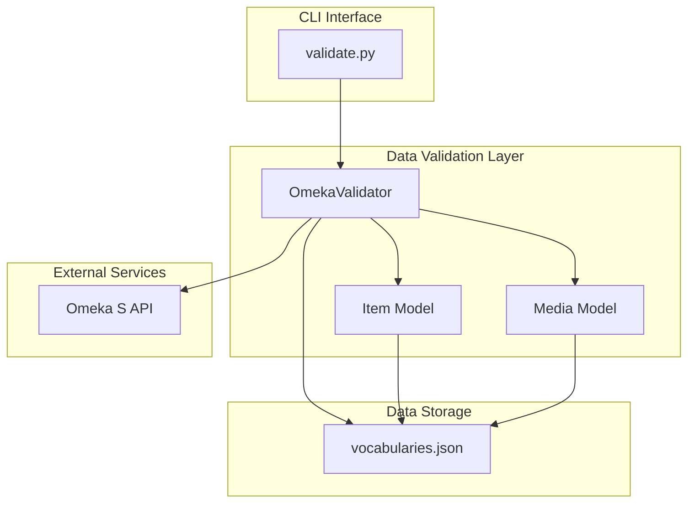
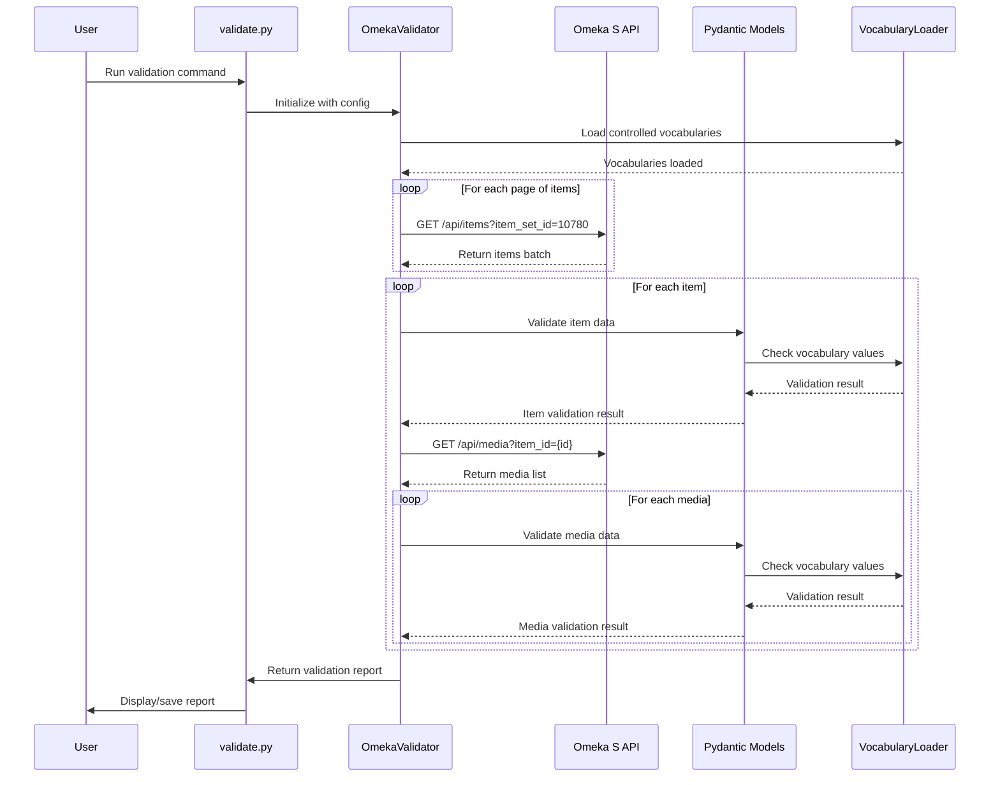
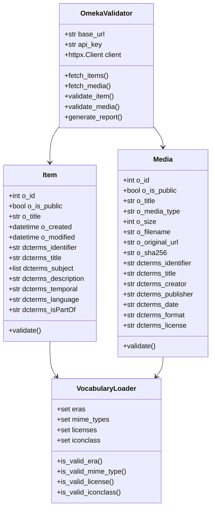

# SGB Data Validator Implementation

This document describes the implementation of the Omeka S data validator for the Stadt.Geschichte.Basel project.

## Overview

The validator validates all items and media in the Omeka S item set 10780 against a comprehensive data model using pydantic. It checks for required fields, controlled vocabularies, well-formed URIs, and empty values.

## Architecture

### System Overview



### Core Components

1. **`validate.py`** - Main CLI script
   - Connects to Omeka S API using httpx
   - Validates items and media using pydantic models
   - Generates comprehensive error reports
   - Supports optional API key authentication

2. **`src/models.py`** - Pydantic data models
   - `OmekaProperty` - Base model for Omeka property values
   - `Item` - Model for Omeka S items with Dublin Core fields
   - `Media` - Model for Omeka S media with Dublin Core fields
   - Includes field validators for required fields and formats

3. **`src/vocabularies.py`** - Vocabulary loader
   - Loads controlled vocabularies from JSON
   - Validates Era, MIME types, Licenses, and Iconclass terms
   - Provides lookup methods for validation

4. **`data/raw/vocabularies.json`** - Controlled vocabularies
   - Stadt.Geschichte.Basel Epoche (7 terms)
   - Internet Media Types (17 terms)
   - Licenses (7 terms)
   - Iconclass (570+ terms)

5. **`test/test_validation.py`** - Test suite
   - Tests validation with sample Omeka S data
   - Tests error handling for invalid data

## Features Implemented

### Validation Process Flow



### Core Requirements

- [x] Uses httpx for API access
- [x] Uses pydantic for validation
- [x] Uses uv for project setup
- [x] Uses ruff for formatting and linting
- [x] Type checking support with mypy annotations
- [x] Optional API key authentication
- [x] Validates all items and media in item set
- [x] Continues validation on errors (doesn't stop)
- [x] Comprehensive error logging

✅ **Validation Rules**

- [x] Required fields must not be empty
- [x] Controlled vocabularies validated (Era, MIME, Licenses, Iconclass)
- [x] URIs must be well-formed (http:// or https://)
- [x] Reports unexpected fields (via pydantic's extra="allow")
- [x] Summary report by item/media and field

✅ **CLI Features**

- [x] Simple command-line interface
- [x] Optional API key parameter
- [x] Configurable base URL and item set ID
- [x] Optional output to file
- [x] Progress indicators during validation

## Usage Examples

### Basic validation

```bash
uv run python validate.py
```

### Save report to file

```bash
uv run python validate.py --output validation_report.txt
```

### Use API key

```bash
uv run python validate.py --api-key YOUR_API_KEY
```

### Validate different item set

```bash
uv run python validate.py --item-set-id 12345
```

### Full options

```bash
uv run python validate.py \
  --base-url https://omeka.unibe.ch \
  --item-set-id 10780 \
  --api-key YOUR_API_KEY \
  --output report.txt
```

## Development

### Install dependencies

```bash
pip install uv
uv sync
```

### Run linter

```bash
uv run ruff check .
```

### Format code

```bash
uv run ruff format .
```

### Run tests

```bash
uv run python test/test_validation.py
```

## Data Model

The validator implements the complete data model from issue #1:



### Item Fields

- `o:id`, `o:is_public`, `o:title` (required)
- `o:created`, `o:modified` (datetime)
- `dcterms:identifier` (required)
- `dcterms:title` (required, must not be empty)
- `dcterms:subject` (Iconclass terms)
- `dcterms:description`
- `dcterms:temporal` (Era vocabulary)
- `dcterms:language` (ISO 639-1)
- `dcterms:isPartOf`

### Media Fields

- `o:id`, `o:is_public`, `o:title` (required)
- `o:ingester`, `o:renderer`
- `o:media_type` (MIME vocabulary)
- `o:size`, `o:filename`, `o:original_url`
- `o:sha256` (hash)
- `dcterms:identifier` (required)
- `dcterms:title` (required, must not be empty)
- `dcterms:subject` (Iconclass terms)
- `dcterms:description`
- `dcterms:creator`, `dcterms:publisher` (URI or text)
- `dcterms:date` (EDTF format)
- `dcterms:temporal` (Era vocabulary)
- `dcterms:type` (DCMI Type URI)
- `dcterms:format` (MIME vocabulary)
- `dcterms:extent`
- `dcterms:source` (URI or text)
- `dcterms:language` (ISO 639-1)
- `dcterms:relation` (URI or text)
- `dcterms:rights`
- `dcterms:license` (License URI vocabulary)
- `o:alt_text`

## Future Enhancements

Potential improvements for future versions:

1. **URI Reachability Check** - Add optional HTTP HEAD requests to verify URIs are accessible
2. **EDTF Validation** - Validate dates conform to Extended Date/Time Format
3. **ISO 639-1 Validation** - Validate language codes against ISO standard
4. **Batch Processing** - Support validating multiple item sets in one run
5. **JSON Report Format** - Output reports in JSON for programmatic processing
6. **Statistics Dashboard** - Generate HTML dashboard with validation statistics
7. **Incremental Validation** - Only validate items modified since last run
8. **Custom Vocabularies** - Support loading additional custom vocabularies

## Notes

- The validator uses pydantic's `extra="allow"` to permit additional fields while still validating known ones
- Network access to omeka.unibe.ch is required for API validation
- The validator continues on errors to check all items/media in the set
- Sample data validation works offline using test/test_validation.py
