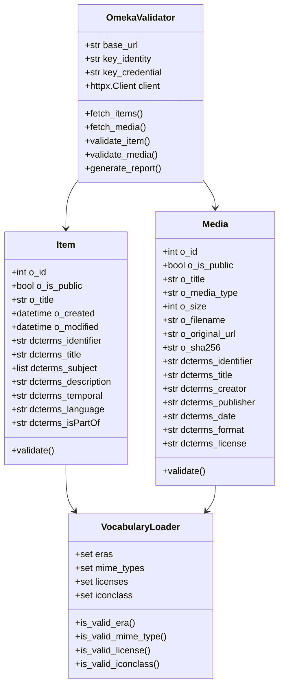

# SGB Data Validator Implementation

This document describes the implementation of the Omeka S data validator for the Stadt.Geschichte.Basel project.

## Overview

The validator validates all items and media in the Omeka S item set 10780 against a comprehensive data model using pydantic. It checks for required fields, controlled vocabularies, well-formed URIs, and empty values.

## Architecture

### System Overview


### Core Components

1. **`validate.py`** - Main CLI script
   - Connects to Omeka S API using httpx
   - Validates items and media using pydantic models
   - Generates comprehensive error reports
   - Supports optional Omeka S authentication (key_identity and key_credential) via CLI or .env file
   - Loads configuration from .env file (command-line args override)

2. **`src/models.py`** - Pydantic data models
   - `OmekaProperty` - Base model for Omeka property values
   - `Item` - Model for Omeka S items with Dublin Core fields
   - `Media` - Model for Omeka S media with Dublin Core fields
   - Includes field validators for required fields and formats

3. **`src/vocabularies.py`** - Vocabulary loader
   - Loads controlled vocabularies from JSON
   - Validates Era, MIME types, Licenses, and Iconclass terms
   - Provides lookup methods for validation

4. **`data/raw/vocabularies.json`** - Controlled vocabularies
   - Stadt.Geschichte.Basel Epoche (7 terms)
   - Internet Media Types (17 terms)
   - Licenses (7 terms)
   - Iconclass (570+ terms)

5. **`test/test_validation.py`** - Test suite
   - Tests validation with sample Omeka S data
   - Tests error handling for invalid data

## Features Implemented

### Validation Process Flow


### Core Requirements

- [x] Uses httpx for API access
- [x] Uses pydantic for validation
- [x] Uses uv for project setup
- [x] Uses ruff for formatting and linting
- [x] Type checking support with mypy annotations
- [x] Optional Omeka S authentication with key_identity and key_credential (CLI or .env file)
- [x] Configuration via .env file with command-line override
- [x] Uses python-dotenv for environment variable loading
- [x] Validates all items and media in item set
- [x] Continues validation on errors (doesn't stop)
- [x] Comprehensive error logging

✅ **Validation Rules**

- [x] Required fields must not be empty
- [x] Controlled vocabularies validated (Era, MIME, Licenses, Iconclass)
- [x] URIs must be well-formed (http:// or https://)
- [x] Reports unexpected fields (via pydantic's extra="allow")
- [x] Summary report by item/media and field
- [x] Warns if literal fields contain URLs (issue #22)

✅ **CLI Features**

- [x] Simple command-line interface
- [x] Configuration via .env file
- [x] Command-line arguments override .env values
- [x] Optional Omeka S authentication parameters (key_identity and key_credential via CLI or .env)
- [x] Configurable base URL and item set ID
- [x] Optional output to file
- [x] Progress indicators during validation
- [x] URI checking with configurable severity
- [x] Data profiling with ydata-profiling

## Configuration

The validator can be configured using a `.env` file or command-line arguments. Command-line arguments override `.env` values.

### Setting up .env file

```bash
cp example.env .env
```

Edit `.env` with your configuration:

```env
OMEKA_URL=https://omeka.unibe.ch
KEY_IDENTITY=YOUR_KEY_IDENTITY
KEY_CREDENTIAL=YOUR_KEY_CREDENTIAL
ITEM_SET_ID=10780
```

### Omeka S Authentication

The validator supports optional authentication with Omeka S using **key_identity** and **key_credential** parameters. These are Omeka S API credentials, not a single API key. Authentication is optional for read operations on public resources but may be required for:

- Accessing private items or item sets
- Rate limiting relief
- Write operations (when using the API module)

You can provide credentials via:

1. `.env` file (recommended for development)
2. Command-line arguments (useful for CI/CD or one-off runs)
3. No credentials (works for public resources)

**Note:** The validator performs read-only operations by default and does not require authentication for public item sets like 10780.

## Usage Examples

### Basic validation (uses .env if present)

```bash
uv run python validate.py
```

### Save report to file

```bash
uv run python validate.py --output validation_report.txt
```

### Use Omeka S authentication (can also be set in .env file)

```bash
uv run python validate.py --key-identity YOUR_KEY_IDENTITY --key-credential YOUR_KEY_CREDENTIAL
```

### Validate different item set

```bash
uv run python validate.py --item-set-id 12345
```

### Full options (override .env values)

```bash
uv run python validate.py \
  --base-url https://omeka.unibe.ch \
  --item-set-id 10780 \
  --key-identity YOUR_KEY_IDENTITY \
  --key-credential YOUR_KEY_CREDENTIAL \
  --output report.txt
```

### URI checking and data profiling

```bash
# Check URIs for broken links (with User-Agent rotation to avoid 403 errors)
uv run python validate.py --check-uris

# Check URIs and detect redirects
uv run python validate.py --check-uris --check-redirects

# Generate data profiling reports
uv run python validate.py --profile --profile-output my_analysis/
```

### URL Detection in Literal Fields

The validator automatically checks all literal-type fields for URLs and generates warnings if any are found. This helps prevent unintentional inclusion of links in fields that are intended to be plain text values.

**What is checked:**
- All `dcterms:*` fields with `type: "literal"`
- Detects URLs starting with `http://`, `https://`, `ftp://`, or `www.`
- Detects URLs embedded within text

**What is NOT checked:**
- URI-type fields (e.g., `dcterms:creator` with `type: "uri"`)
- Fields that are supposed to contain URLs

**Example warning:**
```
[Item 10777] dcterms:description[0]: Literal field contains URL: Visit https://example.com for more
```

This feature was implemented in response to [issue #22](https://github.com/Stadt-Geschichte-Basel/sgb-data-validator/issues/22).

## Development

### Install dependencies

```bash
pip install uv
uv sync
```

### Run linter

```bash
uv run ruff check .
```

### Format code

```bash
uv run ruff format .
```

### Run tests

```bash
uv run python test/test_validation.py
```

## Data Model

The validator implements the complete data model from issue #1:



### Item Fields

- `o:id`, `o:is_public`, `o:title` (required)
- `o:created`, `o:modified` (datetime)
- `dcterms:identifier` (required)
- `dcterms:title` (required, must not be empty)
- `dcterms:subject` (Iconclass terms)
- `dcterms:description`
- `dcterms:temporal` (Era vocabulary)
- `dcterms:language` (ISO 639-1)
- `dcterms:isPartOf`

### Media Fields

- `o:id`, `o:is_public`, `o:title` (required)
- `o:ingester`, `o:renderer`
- `o:media_type` (MIME vocabulary)
- `o:size`, `o:filename`, `o:original_url`
- `o:sha256` (hash)
- `dcterms:identifier` (required)
- `dcterms:title` (required, must not be empty)
- `dcterms:subject` (Iconclass terms)
- `dcterms:description`
- `dcterms:creator`, `dcterms:publisher` (URI or text)
- `dcterms:date` (EDTF format)
- `dcterms:temporal` (Era vocabulary)
- `dcterms:type` (DCMI Type URI)
- `dcterms:format` (MIME vocabulary)
- `dcterms:extent`
- `dcterms:source` (URI or text)
- `dcterms:language` (ISO 639-1)
- `dcterms:relation` (URI or text)
- `dcterms:rights`
- `dcterms:license` (License URI vocabulary)
- `o:alt_text`

## Future Enhancements

Potential improvements for future versions:

1. ~~**URI Reachability Check**~~ - ✅ Implemented with `--check-uris` flag
2. **EDTF Validation** - Validate dates conform to Extended Date/Time Format
3. **ISO 639-1 Validation** - Validate language codes against ISO standard
4. **Batch Processing** - Support validating multiple item sets in one run
5. **JSON Report Format** - Output reports in JSON for programmatic processing
6. ~~**Statistics Dashboard**~~ - ✅ Implemented with `--profile` flag (ydata-profiling)
7. **Incremental Validation** - Only validate items modified since last run
8. **Custom Vocabularies** - Support loading additional custom vocabularies

## Notes

- The validator uses pydantic's `extra="allow"` to permit additional fields while still validating known ones
- Network access to omeka.unibe.ch is required for API validation
- The validator continues on errors to check all items/media in the set
- Sample data validation works offline using test/test_validation.py
