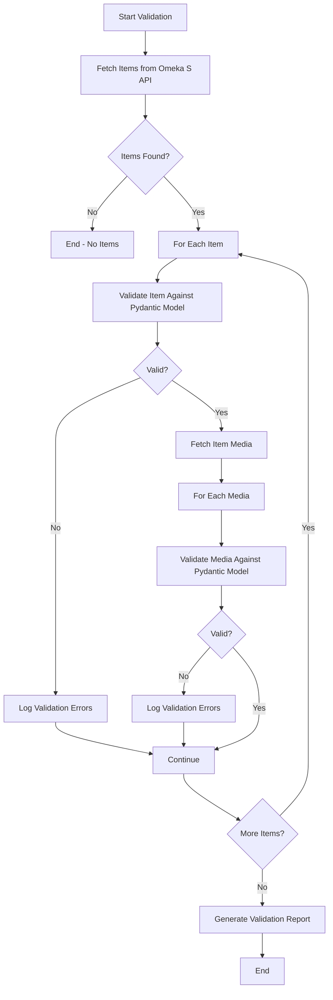

# sgb-data-validator

This repository contains a data validator for the Stadt-Geschichte-Basel project. The data in this repository is openly available to everyone and is intended to support reproducible research.

## Overview

The sgb-data-validator is a Python-based tool that validates metadata quality for the "Stadt.Geschichte.Basel" project's [Omeka S](https://omeka.org/s/) instance. It ensures that cultural heritage items and media objects conform to a comprehensive data model with controlled vocabularies.

**Key features:**

- ✅ **Schema validation** using Pydantic models
- 📚 **Controlled vocabularies** (Era, MIME types, Licenses, Iconclass)
- 🔗 **URI validation** with reachability checks
- 📊 **CSV reports** for easy data quality review  
- 📈 **Data profiling** with interactive HTML reports
- 🔌 **Python API** for programmatic access
- 🚀 **Fast and efficient** with asynchronous processing

[](https://github.com/Stadt-Geschichte-Basel/sgb-data-validator/issues)
[](https://github.com/Stadt-Geschichte-Basel/sgb-data-validator/network)
[](https://github.com/Stadt-Geschichte-Basel/sgb-data-validator/stargazers)
[](https://github.com/Stadt-Geschichte-Basel/sgb-data-validator/blob/main/LICENSE-AGPL.md)
[](https://github.com/Stadt-Geschichte-Basel/sgb-data-validator/blob/main/LICENSE-CCBY.md)
[](https://zenodo.org/badge/latestdoi/ZENODO_RECORD)

## Repository Structure

The structure of this repository follows the [Advanced Structure for Data Analysis](https://the-turing-way.netlify.app/project-design/project-repo/project-repo-advanced.html) of _The Turing Way_ and is organized as follows:

```
sgb-data-validator/
├── src/                    # Source code modules
│   ├── models.py          # Pydantic data models for validation
│   ├── vocabularies.py    # Controlled vocabulary loader and validators
│   ├── iconclass.py       # Iconclass notation parser and validator
│   ├── profiling.py       # Data profiling and analysis utilities
│   └── api.py             # Omeka S API client
├── test/                   # Test suite with pytest
│   ├── test_validation.py # Core validation tests
│   ├── test_iconclass.py  # Iconclass-specific tests
│   └── ...                # Additional test modules
├── data/                   # Data files
│   └── raw/               # Raw input data
│       └── vocabularies.json  # Controlled vocabularies (Era, MIME, Licenses, Iconclass)
├── examples/               # Usage examples and tutorials
│   ├── api_usage.py       # API client examples
│   └── iconclass_usage.py # Iconclass validation examples
├── validate.py            # Main validation script (CLI)
├── main.py                # Alternative entry point
├── pyproject.toml         # Project dependencies and metadata
├── README.md              # This file - main documentation
├── IMPLEMENTATION.md      # Technical implementation details
├── CONTRIBUTING.md        # Contribution guidelines
└── CHANGELOG.md           # Version history and changes
```

### Generated Directories (not in version control)

- `analysis/`: Generated data profiling reports (HTML, CSV)
- `validation_reports/`: Generated validation CSV reports
- `.venv/`: Python virtual environment (created by uv)

## Data Description

This repository contains a Python script to validate data from the "Stadt.Geschichte.Basel" project's Omeka S instance. The script uses pydantic models to validate items and media against a comprehensive data model, checking for:

- Required fields (title, identifier, etc.)
- Controlled vocabularies (Era, MIME types, Licenses, Iconclass)
- Well-formed URIs
- Empty or invalid field values
- Unexpected fields
- URLs in literal fields (warns if plain text fields contain URLs)

The data models, including field names, descriptions, and controlled values, are documented in the `data/raw/vocabularies.json` file.

All rights and intellectual property issues are documented in the `LICENSE-CCBY.md` and `LICENSE-AGPL.md` files.

### Validation Workflow



### Installation

This project uses [uv](https://docs.astral.sh/uv/) for dependency management. To install dependencies:

```bash
pip install uv
uv sync
```

### Configuration

You can configure the validator using a `.env` file. Copy the example file and edit it with your settings:

```bash
cp example.env .env
```

The `.env` file should contain:

```env
OMEKA_URL=https://omeka.unibe.ch
KEY_IDENTITY=YOUR_KEY_IDENTITY
KEY_CREDENTIAL=YOUR_KEY_CREDENTIAL
ITEM_SET_ID=10780
```

**Note:** Command-line parameters will override values from the `.env` file. This allows you to set default values in `.env` and override them when needed.

### Usage

To validate data from the Omeka S API:

```bash
# Validate using settings from .env file
uv run python validate.py

# Validate the default item set (10780) with explicit parameters
uv run python validate.py --base-url https://omeka.unibe.ch --item-set-id 10780

# Save report to file
uv run python validate.py --output validation_report.txt

# Use API keys for authentication (can also be set in .env file)
uv run python validate.py --key-identity YOUR_KEY_IDENTITY --key-credential YOUR_KEY_CREDENTIAL

# Check URIs for broken links (404 errors, etc.) - This may take longer
uv run python validate.py --check-uris

# Check URIs and report redirects to different domains
uv run python validate.py --check-uris --check-redirects

# Treat failed URI checks as errors instead of warnings
uv run python validate.py --check-uris --uri-check-severity error

# Enable data profiling and generate HTML reports
uv run python validate.py --profile

# Enable minimal profiling (faster, less detailed)
uv run python validate.py --profile --profile-minimal

# Specify profiling output directory
uv run python validate.py --profile --profile-output my_analysis/

# Export validation results as CSV files
uv run python validate.py --export-csv

# Specify CSV export directory
uv run python validate.py --export-csv --csv-output my_reports/

# Get help
uv run python validate.py --help
```

#### CSV Validation Reports

The validator can export validation results as CSV files for easier post-processing and review:

- **`--export-csv`**: Export validation results as CSV files (items, media, and summary)
- **`--csv-output`**: Specify output directory for CSV reports (default: `validation_reports/`)

CSV export features:

- **Separate files for items and media**: Creates `items_validation.csv` and `media_validation.csv`
- **One row per resource**: Each row represents a single item or media object
- **One column per field**: Each validation field is a separate column
- **Empty cells for valid fields**: Valid fields have empty cells
- **Error/warning messages in cells**: Invalid fields contain the error or warning message (prefixed with "error:" or "warning:")
- **Edit links**: Each row includes a direct link to edit the resource in Omeka admin interface
- **Summary report**: A `validation_summary.csv` file aggregates key metrics

Example CSV output structure:

```csv
resource_id,edit_link,dcterms:identifier,dcterms:description,o:title
121200,https://omeka.unibe.ch/admin/items/121200,error: Field is required,error: Field is required,
121201,https://omeka.unibe.ch/admin/items/121201,,warning: Missing field,
```

The edit links allow direct navigation to problematic resources:

- Items: `https://omeka.unibe.ch/admin/items/<item_id>`
- Media: `https://omeka.unibe.ch/admin/media/<media_id>`

For detailed documentation on CSV reports, see the [Validation Reports](https://Stadt-Geschichte-Basel.github.io/sgb-data-validator/validation-reports.html) page.

#### URL/URI Checking

The validator can check URLs and URIs in the data to ensure they are reachable:

- **`--check-uris`**: Enable URI checking (validates URLs in dcterms fields and media URLs)
- **`--check-redirects`**: Check for redirects and warn if URLs redirect to different domains (requires `--check-uris`)
- **`--uri-check-severity`**: Set severity for failed URI checks - `warning` (default) or `error`

URI checking features:

- Detects 404 errors and other HTTP status codes (4xx, 5xx)
- Validates URLs in Dublin Core fields (dcterms:creator, dcterms:source, etc.)
- Checks media original URLs
- Uses asynchronous requests for efficient parallel checking
- **Rotates through multiple User-Agent strings to reduce 403 errors**
- Falls back to GET requests when servers don't support HEAD
- Includes realistic browser headers (Accept, Accept-Language, etc.)
- Configurable severity allows treating broken links as warnings or errors
- Optional redirect detection warns when URLs redirect to unexpected domains

#### Data Profiling

The validator can generate comprehensive data profiling reports using [ydata-profiling](https://docs.profiling.ydata.ai/):

- **`--profile`**: Enable data profiling and generate analysis reports
- **`--profile-minimal`**: Generate minimal profiling reports (faster, less detailed)
- **`--profile-output`**: Specify output directory for profiling reports (default: `analysis/`)

Profiling features:

- **Automatic DataFrame conversion**: Converts nested JSON data from Omeka S API into tabular format
- **Interactive HTML reports**: Generates comprehensive HTML reports with statistics, distributions, correlations, and missing values
- **Separate analysis for items and media**: Creates individual reports for items and media with appropriate field handling
- **CSV exports**: Saves flattened data to CSV files for further analysis
- **Correlation analysis**: Identifies relationships between fields
- **Missing data analysis**: Shows patterns of missing or incomplete data
- **Data quality insights**: Helps identify data quality issues and inconsistencies

Example profiling output:

```
analysis/
├── items.csv                   # Flattened items data
├── items_profile.html          # Interactive items report
├── media.csv                   # Flattened media data
└── media_profile.html          # Interactive media report
```

Each HTML report includes:

- Overview with dataset statistics
- Variable details (type, distribution, unique values)
- Correlation matrix
- Missing values analysis
- Sample data previews

### Development

This project uses the following tools from Astral:

- **uv**: Fast Python package installer and resolver
- **ruff**: Fast Python linter and formatter

To run the linter and formatter:

```bash
# Check code
uv run ruff check .

# Format code
uv run ruff format .
```

To run tests:

```bash
uv run python test/test_validation.py
```

### API Usage

The validator provides a comprehensive API for programmatic interaction with Omeka S data:

```python
from src.api import OmekaAPI

# Initialize the API
with OmekaAPI(
    "https://omeka.unibe.ch",
    key_identity="YOUR_KEY_IDENTITY",
    key_credential="YOUR_KEY_CREDENTIAL"
) as api:
    # Read operations
    item_set = api.get_item_set(10780)
    items = api.get_items_from_set(10780)
    item = api.get_item(12345)
    media = api.get_media_from_item(12345)

    # Save operations
    api.save_to_file(items, "backup/items.json")
    loaded_items = api.load_from_file("backup/items.json")

    # Validation
    is_valid, errors = api.validate_item(item_data)
    validation_report = api.validate_item_set(10780)

    # Backup operations
    backup_paths = api.backup_item_set(10780, "backups/")
    restore_status = api.restore_from_backup("backups/itemset_10780_20240101")

    # Update operations (requires write permissions)
    result = api.update_item(12345, updated_data, dry_run=True)
```

For complete examples, see `examples/api_usage.py`:

```bash
uv run python examples/api_usage.py
```

### Troubleshooting

#### Installation Issues

**Problem:** `uv: command not found`

**Solution:** Install uv first:
```bash
pip install uv
```

**Problem:** Dependencies fail to install

**Solution:** Try removing the lock file and re-syncing:
```bash
rm uv.lock
uv sync
```

#### Validation Issues

**Problem:** `KeyError` or `AttributeError` when validating

**Solution:** Ensure you're using the correct Omeka S API version and that your `.env` file has valid credentials.

**Problem:** URI checking is slow or times out

**Solution:** 
- Use `--uri-check-severity warning` to make failed URIs non-blocking
- Reduce concurrent requests by limiting network activity
- Skip URI checking during initial validation runs

**Problem:** 403 errors when checking URIs

**Solution:** The validator already rotates User-Agent strings. If you still get 403 errors, the target server may be rate-limiting. Wait a few minutes and try again.

#### Configuration Issues

**Problem:** Environment variables not loaded from `.env`

**Solution:** Ensure `.env` is in the root directory and not `.env.example`. Command-line parameters override `.env` values.

**Problem:** Cannot connect to Omeka S API

**Solution:** 
- Verify the `OMEKA_URL` in `.env` is correct
- Check network connectivity
- Ensure API credentials have appropriate permissions

#### Performance Issues

**Problem:** Validation is very slow

**Solution:**
- Disable URI checking (`--check-uris`) for faster validation
- Use minimal profiling (`--profile-minimal`) instead of full profiling
- Validate smaller item sets for testing

#### Getting Help

If you encounter issues not listed here:

1. Check the [issue tracker](https://github.com/Stadt-Geschichte-Basel/sgb-data-validator/issues) for similar problems
2. Review the [IMPLEMENTATION.md](IMPLEMENTATION.md) for technical details
3. [Open a new issue](https://github.com/Stadt-Geschichte-Basel/sgb-data-validator/issues/new/choose) with:
   - Your environment (OS, Python version)
   - Steps to reproduce the problem
   - Full error messages and logs
   - What you've already tried

## Use

These data are openly available to everyone and can be used for any research or educational purpose. If you use this data in your research, please cite as specified in `CITATION.cff`. The following citation formats are also available through _Zenodo_:

- [BibTeX](https://zenodo.org/record/ZENODO_RECORD/export/hx)
- [CSL](https://zenodo.org/record/ZENODO_RECORD/export/csl)
- [DataCite](https://zenodo.org/record/ZENODO_RECORD/export/dcite4)
- [Dublin Core](https://zenodo.org/record/ZENODO_RECORD/export/xd)
- [DCAT](https://zenodo.org/record/ZENODO_RECORD/export/dcat)
- [JSON](https://zenodo.org/record/ZENODO_RECORD/export/json)
- [JSON-LD](https://zenodo.org/record/ZENODO_RECORD/export/schemaorg_jsonld)
- [GeoJSON](https://zenodo.org/record/ZENODO_RECORD/export/geojson)
- [MARCXML](https://zenodo.org/record/ZENODO_RECORD/export/xm)

_Zenodo_ provides an [API (REST & OAI-PMH)](https://developers.zenodo.org/) to access the data. For example, the following command will return the metadata for the most recent version of the data

```bash
curl -i https://zenodo.org/api/records/ZENODO_RECORD
```

## Support

This project is maintained by [@maehr](https://github.com/maehr). Please understand that we can't provide individual support via email. We also believe that help is much more valuable when it's shared publicly, so more people can benefit from it.

| Type                                   | Platforms                                                                                      |
| -------------------------------------- | ---------------------------------------------------------------------------------------------- |
| 🚨 **Bug Reports**                     | [GitHub Issue Tracker](https://github.com/Stadt-Geschichte-Basel/sgb-data-validator/issues)    |
| 📊 **Report bad data**                 | [GitHub Issue Tracker](https://github.com/Stadt-Geschichte-Basel/sgb-data-validator/issues)    |
| 📚 **Docs Issue**                      | [GitHub Issue Tracker](https://github.com/Stadt-Geschichte-Basel/sgb-data-validator/issues)    |
| 🎁 **Feature Requests**                | [GitHub Issue Tracker](https://github.com/Stadt-Geschichte-Basel/sgb-data-validator/issues)    |
| 🛡 **Report a security vulnerability** | See [SECURITY.md](SECURITY.md)                                                                 |
| 💬 **General Questions**               | [GitHub Discussions](https://github.com/Stadt-Geschichte-Basel/sgb-data-validator/discussions) |

## Roadmap

No changes are currently planned.

## Contributing

All contributions to this repository are welcome! If you find errors or problems with the data, or if you want to add new data or features, please open an issue or pull request. Please read [CONTRIBUTING.md](CONTRIBUTING.md) for details on our code of conduct and the process for submitting pull requests.

## Versioning

We use [SemVer](http://semver.org/) for versioning. The available versions are listed in the [tags on this repository](https://github.com/Stadt-Geschichte-Basel/sgb-data-validator/tags).

## Authors and acknowledgment

- **Moritz Mähr** - _Initial work_ - [maehr](https://github.com/maehr)

See also the list of [contributors](https://github.com/Stadt-Geschichte-Basel/sgb-data-validator/graphs/contributors) who contributed to this project.

## License

The data in this repository is released under the Creative Commons Attribution 4.0 International (CC BY 4.0) License - see the [LICENSE-CCBY](LICENSE-CCBY.md) file for details. By using this data, you agree to give appropriate credit to the original author(s) and to indicate if any modifications have been made.

The code in this repository is released under the GNU Affero General Public License v3.0 - see the [LICENSE-AGPL](LICENSE-AGPL.md) file for details. By using this code, you agree to make any modifications available under the same license.
